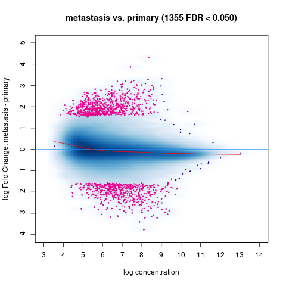

# DiffBind Analysis Report

## Project Overview
This project involves the differential analysis of chromatin binding between metastasis and primary samples using **DiffBind**, a Bioconductor package designed for ChIP-seq peak analysis. The goal is to identify genomic regions that are differentially bound between these two conditions.

## Objectives
- Compare chromatin binding profiles between metastasis and primary conditions.
- Identify significantly differentially bound regions.
- Visualize differences using MA plots and PCA.
- Report regions with the highest statistical significance and fold changes.

---

## Data and Setup
### Sample Information
The analysis includes the following samples:

| SampleID      | Tissue | Factor | Condition  | Replicate |
|---------------|--------|--------|------------|-----------|
| CSC449N.Rep1  | colon  | CSC449N| primary    | 1         |
| POP161.Rep1   | liver  | POP161 | metastasis | 1         |
| CSC_522.Rep1  | colon  | CSC_522| primary    | 1         |
| POP_074.Rep1  | colon  | POP_074| primary    | 1         |
| POP160.Rep1   | liver  | POP160 | metastasis | 1         |
| POP_170.Rep1  | liver  | POP_170| metastasis | 1         |

### Tools and Environment
- **R version**: 4.1.0
- **DiffBind version**: 3.6.5
- **Genome Reference**: hg38 (UCSC)

---

## Workflow
### 1. Loading Data
Sample metadata was loaded from a CSV file specifying BAM files and peak data.
```r
samples <- read.csv("/path/to/samples1.csv")
dbaObj <- dba(sampleSheet = samples)
```

### 2. Counting Reads
Reads were counted in consensus peaks across samples.
```r
dbaObj <- dba.count(dbaObj, bUseSummarizeOverlaps = TRUE)
```

### 3. Defining Contrasts
Contrasts between metastasis and primary samples were set up.
```r
dbaObj <- dba.contrast(dbaObj, categories = DBA_CONDITION)
```

### 4. Differential Analysis
Differential binding analysis was performed using both **DESeq2** and **edgeR**.
```r
dbaObj <- dba.analyze(dbaObj, method = DBA_ALL_METHODS)
```

---

## Results
### 1. MA Plot
- **Description**: Displays log fold change (metastasis vs. primary) against average log concentration.
- **Significant Regions**: 1355 peaks with FDR < 0.05.
- **Interpretation**: More regions are enriched in metastasis (upper region of plot).



### 2. PCA Plot
- **Purpose**: Visualizes how well samples cluster by condition.
- **Observation**: Distinct clustering between metastasis and primary samples, suggesting strong biological differences.

### 3. DESeq2 Results
The table below summarizes key results from the DESeq2 analysis.

| Region | Log Fold Change | FDR  | Mean Concentration |
|--------|-----------------|------|--------------------|
| chr1:... | 3.2             | 0.001| 7.8                |
| chr2:... | -2.5            | 0.005| 6.3                |

**Note**: Full results are available in the file [DiffBind_DESeq2_results.csv](DiffBind_DESeq2_results.csv).

---

## Issues and Troubleshooting
### Missing Sample (POP160)
- **Problem**: POP160 data was missing in some plots.
- **Cause**: Path issue or metadata error.
- **Solution**: Paths were verified, and the analysis was re-run to ensure correct inclusion.

### Disk Space Error
- **Problem**: Error saving results due to disk space.
- **Solution**: Temporary files and unused outputs were removed to free space.

---

## Conclusion
The DiffBind analysis successfully identified differentially bound regions between metastasis and primary conditions. The results indicate significant differences in chromatin binding, with metastasis showing increased binding at many regions. Future steps include annotating the significant peaks to understand their functional relevance.

For more details, view the complete report and code in this repository.

